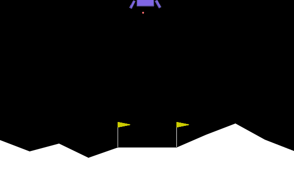
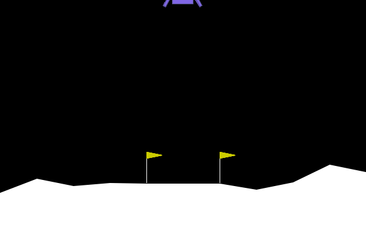
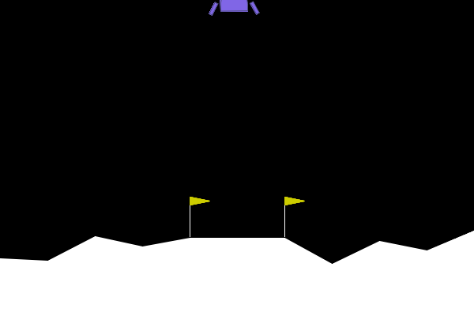

# Lunar-Lander
This repository contains the final project for Reinforcement Learning course of the Master Degree in Data Science and Scientific Computing, A.Y. 2022-2023.

## Training Clips
These training snapshots are captured using a greedy policy after the training phase (~10000 episodes). A random agent is also
provided for comparison:  

**Random**  

**Monte-Carlo**  
  

**Q-learning**  

