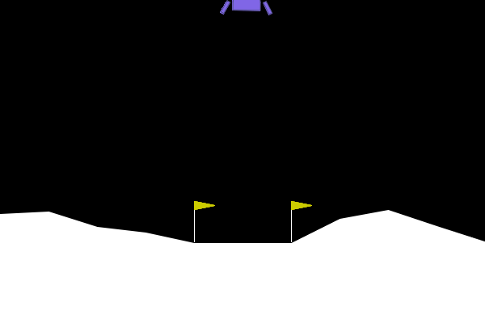
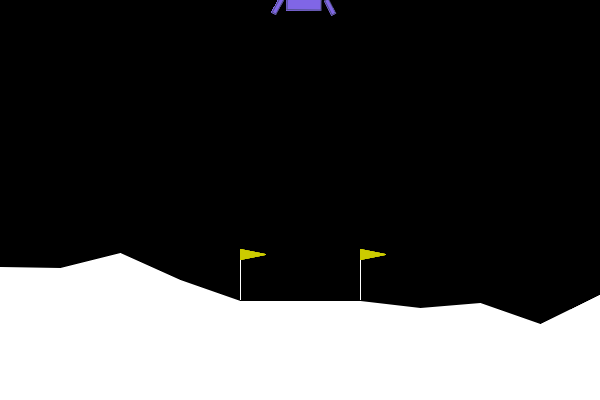

# Lunar-Lander

This repository contains the final project for Reinforcement Learning course of the Master Degree in Data Science and Scientific Computing, A.Y. 2022-2023. The slides for the final presentation are available [here](Lunar_Lander_presentation.pdf).

Goal of this project is to solve the [LunarLander-v2](https://gymnasium.farama.org/environments/box2d/lunar_lander/) OpenAI Gymnasium environment using various model-free reinforcement learning algorithms, namely:

- [Monte Carlo Control](src/MC_lander.py)
- [SARSA](src/SARSA_lander.py)
- [Expected SARSA](src/ESARSA_lander.py)
- [Q-Learning](src/Q_lander.py)

To apply these algorithms, the environment is discretized using a tile coding approach. To reduce the effect of the curse of dimensionality, the discretization is performed in a more effective way.

Each model's hyperparameters are tuned using a grid search approach. The results of this analysis are available in the following folders:

- [data](data) folder, for a general statistical analysis of the performance.
- [Plots](Plots) folder, for a visual representation of the trajectories. 

Final considerations are reported in the presentation.

Notebooks are provided for a better understanding of the code's usage and the results obtained.

## Training Clips

These training snapshots are captured using a greedy policy after the training phase (~10000 episodes). A random agent is also
provided for comparison:  

**Random** 

**Monte-Carlo**  

**SARSA**

**Expected SARSA**

**Q-learning**  

## Implementation References  

1. [Tutor](https://www.ictp.it/member/emanuele-panizon)'s notebooks 
2. [Reinforcement Learning: An Introduction](http://incompleteideas.net/book/the-book-2nd.html)
3. [Solving The Lunar Lander Problem under Uncertainty using Reinforcement Learning](https://arxiv.org/abs/2011.11850)

